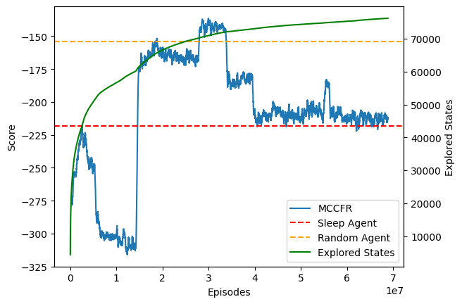
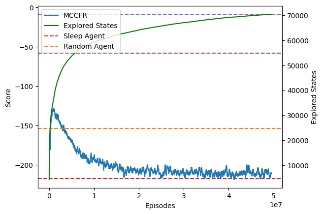
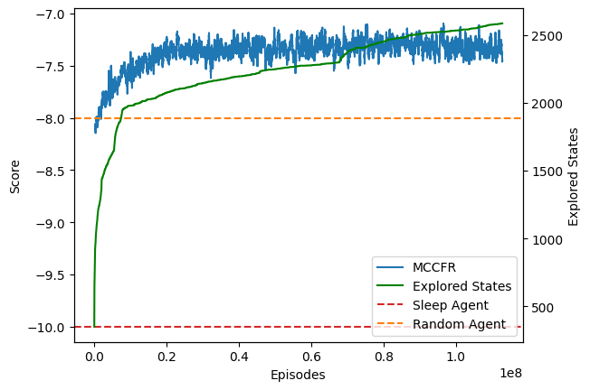

## Log_lobotomy
Used CFR+ with possibly buggy cum_strat smoothing (divided by 1e6 anytime sum(cum_strat) > 1e12). This may be what caused catastrophic forgetting?

## Hybrid
CFR+ to update cum_regret, Vanilla CFR to update cum_strat (-e10 means using episodes of len 10. Otherwise, assume 30)

